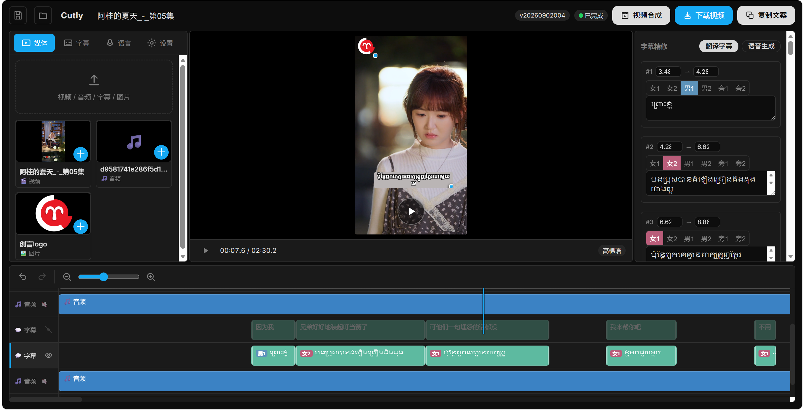
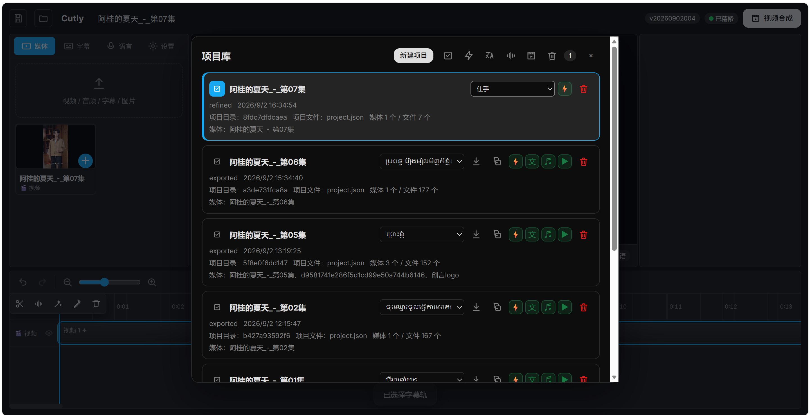

# 🎬 DramaLocalizer — AI 影视本地化工作台

<p align="center">
  <a href="README_zh-CN.md"></a>
  <a href="README.md"></a>
</p>

> 把原始视频变成「配音 + 字幕 + 可直接发社交媒体」的本地化成品——**全程跑在你自己的服务器上**。上传一段片子，DramaLocalizer 自动完成语音识别、人工精修字幕、LLM 翻译、神经网络 TTS 配音、人声分离和 FFmpeg 合成。

<p align="center">
  
  
  
  
  
  
</p>

---

## 🌟 为什么用 DramaLocalizer？

- **🎯 一条流水线，零胶水代码** —— 上传 → 识别 → 翻译 → 配音 → 去人声 → 合成 → 下载，全部在一个网页里完成。
- **🏠 自托管、数据私有** —— Whisper、Demucs 等重模型全部本地运行，只有翻译和 TTS 调用会出网；你的视频素材不经过任何第三方。
- **✍️ 人在回路** —— 识别出的字幕在翻译前可人工精修，时间和文案都完全可控。
- **🪄 自动推广文案** —— 合成成功后，LLM 会生成中文剧情钩子和 #标签，并翻译成英文与目标语言，按项目存入 `promo_copy`。
- **🚀 生产级交付** —— 自带一键 `install.sh`、systemd 单元，以及会做 rsync + 重启 + 健康检查 + 回滚的 `deploy_d.py`。

```
            ┌─────────────── 视频 ───────────────┐
            │                                       │
            ▼                                       │
      音频分离 ──▶ Whisper 识别 ──▶ 字幕精修（你）
                                                  │
                                                  ▼
   下载 ◀── FFmpeg 合成（字幕+图片） ◀── 时间轴编辑
        │                                        ▲
        │                                        │
        └─ promo_copy ◀─ LLM 翻译 ◀─ Edge TTS 配音 ◀─ Demucs（去人声）
```

## ✨ 功能特性

| 功能 | 说明 |
| --- | --- |
| 🎙️ 语音识别 | 本地 **faster-whisper** `large-v3-turbo`，输出带时间戳的中文台词。 |
| ✍️ 字幕编辑器 | 网页端精修识别文本与时间轴。 |
| 🌐 LLM 翻译 | 阿里云百炼 OpenAI 兼容接口（默认 `deepseek-v4-flash`），失败逐句重试。 |
| 🔊 神经网络 TTS 配音 | **Edge TTS** 按句生成目标语言配音，声线由语言 + 女声/男声/旁白标识选择。 |
| 🎚️ 人声分离 | 本地 **Demucs** `htdemucs` 去除人声、保留伴奏。 |
| 🎞️ 视频合成 | **FFmpeg**（libass）把字幕与图片烧录进成片。 |
| 🪄 推广文案 | 自动生成中文剧情钩子 + #标签，并译出英文与目标语言版本。 |
| 🖥️ 网页界面 | 单文件 SPA（`static/index.html`），轮询任务进度。 |
| 📦 部署与运维 | `install.sh`（systemd + 字体 + 开机启动）与 `deploy_d.py`（rsync + 健康检查 + 回滚）。 |

## 📸 截图

<p align="center">
  <br>
  <sub>主工作台</sub>
</p>
<p align="center">
  <br>
  <sub>项目库</sub>
</p>

## 🧱 技术栈

| 层 | 选型 |
| --- | --- |
| 后端 | **FastAPI**（已在 Python 3.14 验证） |
| 语音识别 | **faster-whisper** `large-v3-turbo` |
| 翻译 | 阿里云百炼 OpenAI 兼容接口（`deepseek-v4-flash`） |
| 文字转语音 | **Microsoft Edge TTS** |
| 人声分离 | **Demucs** `htdemucs` |
| 视频合成 | **FFmpeg** + `libass` 字幕 |
| 前端 | 单文件 SPA（`static/index.html`） |
| 部署 | `rsync` + `systemd` + SSH（`paramiko`） |
| 字体 | Noto Sans Khmer（及其他）via fontconfig |

## 📂 目录结构

```
DramaLocalizer/
├── install.sh              # 一键安装：生成 systemd 单元 + 安装字体 + 开机启动
├── 说明.md                 # 完整架构 / 部署 / 迁移说明（中文）
├── README.md               # 英文说明（本文件为对照）
├── README_zh-CN.md         # 本文件（中文）
├── 屏幕截图1.png / 屏幕截图2.png
└── drama_localizer_ym/     # 应用源码 + 模型缓存 + 文档
    ├── workstation.py      # FastAPI 后端：路由、任务状态机、项目与文件管理
    ├── pipeline.py         # 本地化引擎
    ├── static/index.html   # 前端 SPA
    ├── deploy_d.py         # 远程部署（rsync + systemd + 健康检查 + 回滚）
    ├── run.sh              # 启动脚本（uvicorn + 固定模型缓存路径）
    ├── drama_localizer.service  # systemd 单元示例
    ├── fetch_fonts.sh      # 备用字体下载脚本
    ├── requirements.txt / requirements-dev.txt / pyproject.toml
    ├── .env.example        # 配置样例
    ├── AUDIT.md / DELIVERY.md   # 审计与交付文档
    └── fonts/              # （已 gitignore）可直接部署的字体
```

> 运行期产物（`venv/`、`models/`、`output/`、`workstation.log`、真实 `.env`）**不入库** —— 见 `.gitignore`。

## ⚙️ 工作原理

```
视频 ──▶ 音频分离 ──▶ Whisper 识别 ──▶ 字幕精修（人工）
                                          │
                                          ▼
下载 ◀── FFmpeg 合成（字幕+图片） ◀── 时间轴编辑 ◀── Demucs（去人声）
   │                                           ▲
   │                                           │
   └─ promo_copy ◀─ LLM 翻译 ◀─ Edge TTS 配音 ┘
```

**工程亮点**

- **重任务走线程。** 识别、翻译、TTS、Demucs、FFmpeg 均在后台线程执行，前端轮询 `/d/api` 获取进度，界面不卡顿。
- **按项目串行。** 项目库的批量操作逐项目串行执行，不并发轰击模型或外部服务。
- **模型缓存固定。** `run.sh` 把模型缓存固定指向 `drama_localizer_ym/models/`，迁移时不再依赖 `~/.cache`。
- **部署带健康检查。** `deploy_d.py` 上传源码、远端校验、保留回滚备份、重启服务并探测 `/d/api/version` 后才判定成功。

## 📥 安装

### 方式 A — 一键安装（推荐）

在全新的 Ubuntu 24.04/26.04 服务器上：

```bash
sudo apt update
sudo apt install -y python3 python3-venv python3-pip ffmpeg curl fontconfig \
  ca-certificates build-essential libsndfile1 rsync

git clone https://github.com/Juzer7113/DramaLocalizer.git
cd DramaLocalizer
sudo bash install.sh          # 生成 systemd 单元、安装字体、设置开机启动
```

`install.sh` 会根据当前目录自动推导运行目录、模型目录、日志路径与字体，并启用开机启动。若运行用户不是目录所有者，用 `sudo CUTLY_USER=<用户名> bash install.sh`。

### 方式 B — 手动 / 从源码安装

完整步骤（服务器要求、Swap、venv、`.env`、字体注册、systemd 加固、10 项验收清单）见 [说明.md](说明.md)。精简版：

```bash
# 1. 装上面的系统依赖 + 建 juzer 用户 + /www/wwwroot/aidj/drama_localizer*
# 2. 复制源码（排除 venv/models/.env/output）
sudo rsync -a --delete \
  --exclude models --exclude .git --exclude .env --exclude venv \
  --exclude output --exclude backups --exclude workstation.log \
  /path/to/DramaLocalizer/ /www/wwwroot/aidj/drama_localizer/
# 3. 建 python venv 并 pip install -r requirements.txt
# 4. cp .env.example .env 并填好密钥
# 5. 注册字体、建 drama_localizer.service、systemctl enable --now
```

## 🕹️ 使用

1. 浏览器打开 `http://<服务器IP>:8000/d`。
2. 输入 `.env` 中的 `WORKSTATION_API_KEY`。
3. **上传** 视频。
4. **精修** 识别出的（Whisper）字幕 —— 修正时间和文案。
5. 选择**目标语言**，**翻译**（LLM）并**生成 TTS 配音**。
6. **去人声**（Demucs）并**编辑时间轴**，然后 **FFmpeg 合成**。
7. **下载** 成片；在主页面或项目库复制自动生成的 `promo_copy`（剧情钩子 + 标签）。

## ⚙️ 配置

把 `.env.example` 复制为 `.env` 并编辑。关键变量：

| 变量 | 含义 | 示例 |
| --- | --- | --- |
| `WORKSTATION_API_KEY` | 工作台网页访问密钥 | `set-a-secret-key` |
| `WHISPER_MODEL` | 本地识别模型 | `large-v3-turbo` |
| `LLM_API_KEY` | 翻译接口密钥 | `sk-...` |
| `LLM_BASE_URL` | OpenAI 兼容接口地址 | `https://dashscope.aliyuncs.com/compatible-mode/v1` |
| `LLM_MODEL` | 翻译模型 | `deepseek-v4-flash` |
| `TTS_PROVIDER` | 配音后端 | `edge` |
| `SRC_LANG` | 源语言 | `zh` |
| `TGT_LANG` | 流水线默认目标语言 | `km` |
| `TARGET_LANG` | 工作台新建项目默认目标语言 | `km` |

`TGT_LANG` 是底层流水线默认值；`TARGET_LANG` 是工作台新建项目默认值。两者通常设为相同值，但都可在前端按项目单独切换。

## 🚀 部署

改完源码后，同步提升 `static/index.html` 和 `workstation.py` 的 `APP_VER`，然后：

```bash
export DRAMA_HOST='你的服务器IP'
export DRAMA_SSH_PASSWORD='服务器密码'
export WORKSTATION_API_KEY="$(cat WORKSTATION_ACCESS_KEY.txt)"
python deploy_d.py
```

`deploy_d.py` 会上传源码、远端校验、在 `backups/` 保留回滚备份、重启 systemd 服务并探测 `/d/api/version`。部署后浏览器执行 `Ctrl+Shift+R` 硬刷新。

## 🛠️ 故障排查

| 现象 | 处理 |
| --- | --- |
| 页面打不开 / 502 | 查 `systemctl status drama_localizer`；确认放行 TCP 8000（`sudo ufw allow 8000/tcp`，仅当启用 UFW 时）；检查云安全组。 |
| 字幕不显示高棉字形 | `sudo -u juzer fc-match 'Noto Sans Khmer'` 应能解析；否则从 `fonts/` 重装字体。 |
| Whisper 慢或被 OOM 杀 | 确保 ≥ 8 GB 内存 + 4 GB Swap；用 `swapon --show` 确认。 |
| 翻译失败 | 查 `LLM_API_KEY` / `LLM_BASE_URL` 可达性，看 `workstation.log`。 |
| TTS 没有声音 | Edge TTS 需要出网，确认服务器能访问。 |
| 缺 `subtitles` 滤镜 | `ffmpeg -hide_banner -filters \| grep subtitles` 必须列出；重装带 libass 的 ffmpeg。 |

运行日志：`/www/wwwroot/aidj/drama_localizer/workstation.log`（超过 1MB 自动清空）。

## 📝 更新日志

### v20260904015 — 首次公开源码发布
- FastAPI 后端（`workstation.py`）：任务状态机、项目与文件管理，配套单文件 SPA 前端（`static/index.html`）。
- 本地化流水线：faster-whisper 识别 → 人工字幕精修 → LLM 翻译 → Edge TTS 配音 → Demucs 去人声 → FFmpeg 合成。
- 自动生成 `promo_copy`（剧情钩子 + 标签）中文、英文及目标语言版本。
- `install.sh`（systemd + 字体 + 开机启动）与 `deploy_d.py`（rsync + 健康检查 + 回滚）。
- `.env.example`、`drama_localizer.service`、`fetch_fonts.sh`、`requirements.txt`、`pyproject.toml`。

## 📜 许可证

内部使用。本仓库仅用于源码管理与自托管部署；**不授予开源许可证，禁止再分发**。请保管好 `.env`、`models/`、`output/` 与 `workstation.log`，不要上传公共网盘或代码仓库。

## ☕ 喜欢就支持一下

如果 DramaLocalizer 帮你省了时间，点个 ⭐、提个 PR，或分享给做视频本地化的朋友。欢迎反馈和报 bug。
